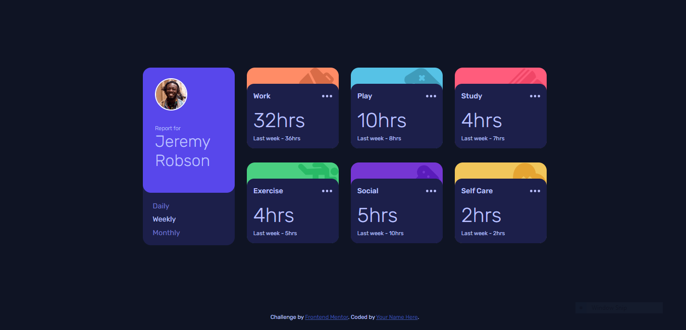

# Frontend Mentor - Time tracking dashboard solution

This is a solution to the [Time tracking dashboard challenge on Frontend Mentor](https://www.frontendmentor.io/challenges/time-tracking-dashboard-UIQ7167Jw). Frontend Mentor challenges help you improve your coding skills by building realistic projects. 

## Table of contents

- [Overview](#overview)
  - [The challenge](#the-challenge)
  - [Screenshot](#screenshot)
  - [Links](#links)
- [My process](#my-process)
  - [Built with](#built-with)
  - [What I learned](#what-i-learned)
  - [Useful resources](#useful-resources)
- [Author](#author)

## Overview

To recreate the dashboard pictured for desktop: 

### The challenge

Users should be able to:

- View the optimal layout for the site depending on their device's screen size
- See hover states for all interactive elements on the page
- Switch between viewing Daily, Weekly, and Monthly stats

### Screenshot

My solution:

### Links

<!-- - Solution URL: [Add solution URL here](https://your-solution-url.com) -->
- Live Site URL: [Live site](https://tombirbeck.github.io/time-tracking-dashboard/)

## My process

Initially I set the box-sixing of the page to border-box and the padding and margin to 0 to give myself a clean canvas to work with. I then created custom variables for the colours, imported the font and set the default font size.\
I then began to set the layout for the page by creating the elements for the user card and the individual cards for the different events. I decided to use grid to create the layout because I felt it was the most suited to the task.
When the layout was done, I hard coded the data on the page and added the initial styling.\
At this point I worked on getting the data to render dynamically, first by capturing the elements I need and then importing the data.json file and iterating over the titles property to assign them to the correct element on the page.
I then worked on using radio buttons for the 'daily', 'weekly' and 'monthly' options. I styled them so that only the labels appeared and added an event listener to each one so that the page could display the correct information when clicked.\
Finally, I set the background images of each card and added a few final touches to the styling.

### Built with

- Semantic HTML5 markup
- CSS custom properties
- Flexbox
- CSS Grid
- JavaScript
- Json

### What I learned

This was a good challenge to work on using grid to set the layout of a page and for learning about tweaking background images.

### Useful resources

- [w3schools](https://www.w3schools.com/css/css_background_repeat.asp) - This was very useful for learning how to stop the background image from repeating and positioning it correctly.

## Author

- Portfolio - [Tom Birbeck](https://portfolio-tombirbeck.vercel.app/)
- Frontend Mentor - [@TomBirbeck](https://www.frontendmentor.io/profile/TomBirbeck)

